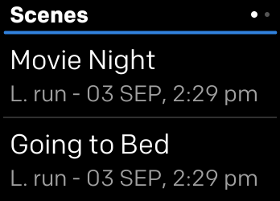

# Things

Things is a lightweight app that lets you control Samsung SmartThings scenes and devices from Fitbit watch.

Get the app [here](https://gallery.fitbit.com/details/257e2c25-52a7-46b7-980e-5db36789ccf1)

## Installation

git clone https://github.com/Ed2Bs/fitbit-things-app.git

cd fitbit-things-app

npm install

npx fitbit-build generate-appid

npx fitbit-build

npx fitbit

fitbit$ install

For more info visit [Get started](https://dev.fitbit.com/getting-started/) with the Fitbit Software Development Kit (SDK)

### License

Licensed under the [MIT License](./LICENSE).
